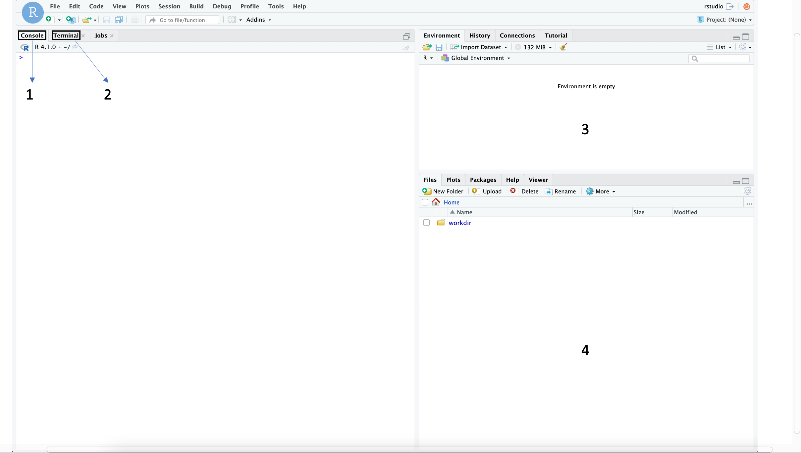

# Setting in the remote environment


## General structure

Each student will get their own container for the duration of the course, where they can work, share and store data. 
This environment can be accessed with any internet browser, by going to your assigned port, which should look similar like http://1.23.45.678:10034.
In the container, you can find the following shared directories:

- /data: read only, and shared between all running containers. This directory is used to have a single place to store data
- /group_work: read and write enabled for all participants, and shared between all containers. This can be used to share data/scripts between students.
- ~/workdir: read and write enabled, and only shared between containers assigned to the same participant.
    
All directories other than the shared directories only exist within the container.

When visiting your assigned port, you should see the following window:



For our course, we will work mostly in the Terminal (Bash) for Part 1, and in the console (R) for Part2.

## Console

##Terminal

In order to use the preinstalled programms you will use during this course, it is first necessary to activate the conda environment in which they were installed.
To do this, go to the terminal tab and type 

```bash
conda activate project3
```
Afterwards, you should see (project3) on the left side, indicating that you are currently working within that environment.

