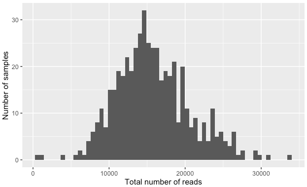
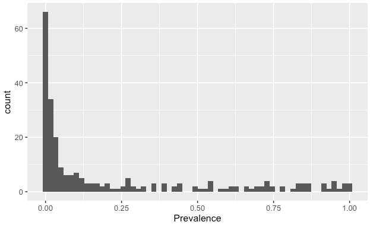
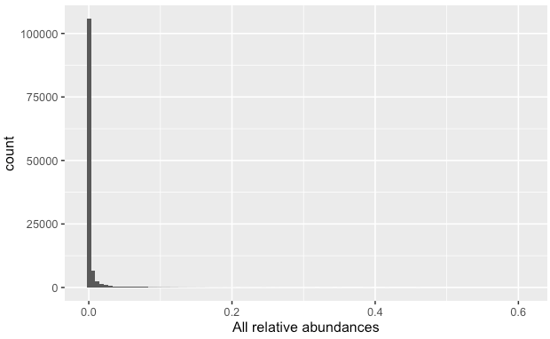
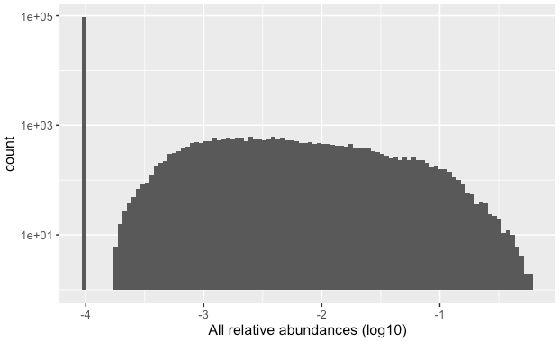
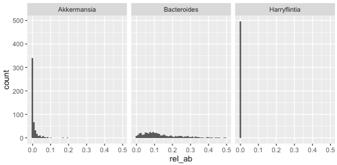

# Solutions Step 1: Taxonomic profiling of metagenomic samples with mOTUs

General note: this guide has been written assuming you use a Mac or Linux Command Line.

---

## Download example sequencing data


 Explore the files, in particular you can check:

  - How many reads there are per sample?
    <details>
    <summary markdown="span">Solution 1</summary>

    Knowing that each read takes up four lines in the fastq file, we can simply count the number of lines with `wc -l` and divide the result by `4`. The following command does it all in one line. 
    ```bash
    echo $(cat sampleA_1.fastq|wc -l)/4|bc
    ```
    </details> 
 
    <details>
    <summary markdown="span">Solution 2</summary>
     
    We can count the number of lines with `@read`:
    ```bash
    grep -c "@read" sampleA_1.fastq
    ```
 
    </details>

- What is the average length of the reads? Is there a difference between the read lengths in the forward and reverse files?
    <details>
    <summary markdown="span">Solution 1</summary>
 
    We can first extract only the sequences:
    ```bash
    grep -A 1 "@read" sampleA_1.fastq  | grep -v "\-\-" | grep -v "read" > sequences_sampleA_1
    ```
    With `-A 1` we select also 1 row after the match. With `grep -v` we remove what is not needed. We can now check the length with:
    ```bash
    cat sequences_sampleA_1 | awk '{print length}'
    ```
    This will print a big list, we can count how many times each length appear:
    ```bash
    cat sequences_sampleA_1 | awk '{print length}' | sort | uniq -c | sort -n | tail
    ```
    Which produces:
    ```bash
      238 96
      242 92
      258 93
      341 97
      344 94
      346 95   
      428 98
      849 20
     1194 99
    61306 100
    ```
    So the majority of the reads have length 100 (61,306 out of 67,926, 90%)
 
    </details>
    
    <details>
    <summary markdown="span">Solution 2</summary>
 
    To quickly check the average length of the reads in the terminal, do: 
    ```bash
    awk 'NR%4==2{sum+=length($0)}END{print sum/(NR/4)}' sampleA_1.fastq
    ```
    The average read length in the reverse reads seem to be slightly lower in all the samples.

    </details>

- Do you have the same read IDs in the forward and reverse file? 
      <details>
    <summary markdown="span">Solution</summary>

    Since these are paired reads, the read ids should be identical and in the same order. You can check this in the terminal like so: 

    ```bash
    #get list of read ids from the forward and reverse files
    grep '@read' sampleA_1.fastq > sampleA_ids_1.txt
    grep '@read' sampleA_2.fastq > sampleA_ids_2.txt
    #check if they are identical 
    diff -s sampleA_ids_1.txt  sampleA_ids_2.txt
    ```

    </details>

There are many different ways of performing the same task. If you have done something different and accomplished the same thing, awesome!


## Check the quality of the sequencing data

- Which part of the reads is of lower quality?
    <details>
    <summary markdown="span">Solution</summary>

    The ends of the reads are typically of lower quality. This is to be expected. The quality of calls typically degrades as the run progresses due to problems in the sequencing chemistry. 

    </details>
- Is there any difference between the quality of the forward and reverse reads?
    <details>
    <summary markdown="span">Solution</summary>

    Reverse reads are usually of lower quality than forward reads, particularly at the read ends. Again this is due to the way paired end sequencing is performed with the forward orientiation is sequenced first followed by the reverse orientation. 

    </details>


## Filter and trim reads

- Try to run trimmomatic (you can use different parameters).

    <details>
    <summary markdown="span">Solution</summary>
    
    Here is an example command: 

    ```bash
    trimmomatic PE sampleA_1.fastq sampleA_2.fastq sampleA_filtered_1P.fastq sampleA_filtered_1U.fastq sampleA_filtered_2P.fastq sampleA_filtered_2U.fastq ILLUMINACLIP:TruSeq3-PE.fa:2:30:10 LEADING:3 TRAILING:3 SLIDINGWINDOW:4:15 MINLEN:36
    ``` 
    Here is a description of the parameters used in this specific command. You may have explored other parameters too. 

    - `ILLUMINACLIP`: specifies the file containing the adapter sequences to trim and additional parameters on how to perform the adapter trimming. `TruSeq3-PE.fa` (provided by `trimmomatic`) contains the Illumina adapter sequences used by HiSeq and MiSeq machines. 
    - `LEADING`: Remove low quality bases (lower than `3`) from the beginning of the reads. 
    - `TRAILING`: Remove low quality bases (lower than `3`) from the ends of the reads.
    - `SLIDINGWINDOW`: consider a window of bases (here `4` at once) and trim once the average quality within the window falls below a threshold quality (here `15`). 
    - `MINLEN`: remove reads lower than the specified min length (here `36`)
    </details>


- How many files did trimmomatic generate? What do they contain?
    <details>
    <summary markdown="span">Solution</summary>
    
    4 files are produced

    - sampleA_filtered_1P, containing the forward reads that pass the filter and have a mate (in filtered_2P);
    - sampleA_filtered_1U, containing the forward reads that pass the filter and do not have a mate (the paired reverse read didn't pass the filter)
    - sampleA_filtered_2P, containing the reverse reads that pass the filter and have a mate (in filtered_1P);
    - sampleA_filtered_2U, containing the reverse reads that pass the filter and do not have a mate (the paired forward read didn't pass the filter)

    </details>
- How many reads have been filtered out?
    <details>
    <summary markdown="span">Solution</summary>
    
     866 reads (1.27%) of all reads were filtered out from sampleA using the above parameters. 

    </details>
 
- Check the quality of the filtered reads. Did the quality improve?
    <details>
    <summary markdown="span">Solution</summary>
     
     You can check the quality of the filterd reads again with fastqc. 

     ```
     fastqc sampleA_filtered_1P.fastq
     fastqc sampleA_filtered_2P.fastq
     ```
     The quality of reads (particularly of the reverse reads) has improved!
    </details>
 
## Taxonomic profiling with mOTUs

- Use `motus` (manual: [link](https://github.com/motu-tool/mOTUs_v2#simple-examples)) to create a profile from the files created by trimmomatic.
      <details>
    <summary markdown="span">Solution</summary>
     Here is the mOTU command to generate a taxonomic profile using default parameters.

     ```bash
     motus profile -f sampleA_filterd_1P.fastq -r sampleA_filtered_2P.fastq -s sampleA_filtered_1U.fastq,sampleA_filtered_2U.fastq -n sampleA -o sampleA_profile.txt
     ```

    </details>
- How many species are detected? How many are reference species and how many are unknown species?
      <details>
    <summary markdown="span">Solution</summary>
    You can quickly check how many species were detected with:

    ```bash
    #this also counts unassigned so subtract 1 from the result
    grep -c -v '0.0000000000\|#' sampleA_profile.txt
    ```
    `97` species were dectected. 
    Around `3.4 %` were unassigned . 

    You can check how many ref-mOTUs were detected using these command:
    ```bash
    grep -v '0.0000000000\|#' sampleA_profile.txt > sampleA_profile_detected.txt
    grep -c 'ref_mOTU_v3_' sampleA_profile_detected.txt
    ```
    `39` ref-mOTUs were detected in sampleA. Note that this number is also reported as stdout when you run `motus profile`

    </details>
  

- Can you change some parameters in `motus` to profile more or less species? (Hint, look [here](https://github.com/motu-tool/mOTUs/wiki/Increase-precision-or-recall))
        <details>
    <summary markdown="span">Solution</summary>
    Precision is the number of TP out of the total number of detected species. 

    Recall is the number of detected species out of all the species actually present in the sample. 

    To increase precision at the cost of recall you can increase parameters `-g` (default: 3) and -l (default: 75). 

    ```bash 
    motus profile -f sampleA_filterd_1P.fastq -r sampleA_filtered_2P.fastq -s sampleA_filtered_1U.fastq,sampleA_filtered_2U.fastq -n sampleA -o sampleA_profile_high_p.txt -g 8 -l 90
    ```
    We have detected just 37 species. 

    To increase recall at the cost of having more false positives you can do:

    ```bash 
    motus profile -f sampleA_filterd_1P.fastq -r sampleA_filtered_2P.fastq -s sampleA_filtered_1U.fastq,sampleA_filtered_2U.fastq -n sampleA -o sampleA_profile_high_r.txt -g 1 -l 45
    ```
    We have detected `331` species. 

    </details>


- How can you merge different motus profiles into one file? Try to profile and then merge three profiles (Sample A, B and C).

    <details>
    <summary markdown="span">Solution</summary>

    After creating the individual tax profiles for all the samples, do: 
    
    ```bash
    motus merge - i sampleA_profile.txt,sampleB_profile.txt,sampleC_profile.txt -o merged_profiles.txt
    ```
    This results in a tab-separated file containing the tax profiles. 
    </details>

## Explore taxonomic profiles

Explore the taxonomic profiles (`tax_profile`).  

<details>
<summary markdown="span">Solution</summary>

Load packages and taxonomic profile into your R environment

```r
#packages
library(tidyverse)

#tax profiles
load(url("https://zenodo.org/record/6517497/files/human_microbiome_dataset.Rdata"))
```

Let's have a quick peek at our data. 
```r
dim(tax_profile)
```

There are 246 rows and 496 columns. Let's check the content:
 
```r
tax_profile[1:3,1:3]
```
Which results in:
```bash
             700002_T0 700002_T1 700002_T2
Blautia            229      1196      1758
Bacteroides       4018      1705      1660
Agathobacter        80      1580       126
```
The rows are genera and the columns are samples.
 
```r
head(metadata)
```
 
Which is:
```bash
          Subject Timepoint Sex
700002_T0  700002         0   M
700002_T1  700002        12   M
700002_T2  700002        24   M
700002_T3  700002        50   M
700004_T0  700004         0   F
700004_T1  700004        12   F
```
 
The 496 samples are from 124 patients (sampled 4 times over the course of the year). `tax_profile` contains the read counts of of species (rows) across all samples (columns).

For each sample, we know the corresponding subject id, timepoint of sampling and the sex of the subject. 


</details>

Here are some hints of what you can check:

- How many reads there are per sample?
    <details>
    <summary markdown="span">Solution</summary>

    Calculate total number of reads in every sample (also called library size of sample)

    ```r
    sample_read_counts <- data.frame(total_read_counts = colSums(tax_profile))
    ```

    How are the sample read counts distributed? 
    ```r
    ggplot(data = sample_read_counts) + geom_histogram(mapping = aes(x = total_read_counts), bins = 60) + ylab('Number of samples') + xlab('Total number of reads')
    ```
    Which results in:
    
    
    
    Note how variable the total read counts are across all samples. This is a problem because this variation is most likely a result of the sequencing process and not any meaningful biological variation.

    </details>


- If you want to compare different samples, is it a problem that there are different read counts? Try to divide each value within a sample by the sum of the reads in that sample to normalise the data (also called relative abundance).
  

    <details>
    <summary markdown="span">Solution</summary>

    We need to remove this technical variation caused by differing total read counts to meaningfully compare samples. 
    We can do this by **relative abundance normalization** where we divide each value within a sample by the total read counts in that sample.

    ```r
    rel_ab = prop.table(tax_profile,2)
    ```
 
    Now the abundances of each sample should sum to 1. 

    ```r
    all(colSums(rel_ab) == 1)
    ```

    </details>

 
 
- Which genera are the most and least prevalent?

    <details>
    <summary markdown="span">Solution</summary>

    Prevalence of a species refers to the the proportion of samples in which that species is detected. 

    First we calculate prevalence for all the genera. 
    ```r
    number_of_samples = dim(tax_profile)[2]
    prevalence_df <- data.frame(Prevalence = rowSums(rel_ab>0)/number_of_samples, genus = rownames(tax_profile))
    ```

    You can plot an histogram of the prevalences:
    ```r
    ggplot(data = prevalence_df) + geom_histogram(mapping = aes(x = Prevalence), bins = 60)
    ```
    
    

    You can see that there are many species that apper only few times (on the left), and there are only few species that are present in all samples (on the right). We can also check which genera are the most prevalent:
    ```R
    head(prevalence_df[order(prevalence_df$Prevalence,decreasing = T),])
    ```
    Result:
    ```R
                     Prevalence            genus
    Blautia           1.0000000          Blautia
    Bacteroides       1.0000000      Bacteroides
    -1                1.0000000               -1
    Faecalibacterium  0.9899194 Faecalibacterium
    Anaerostipes      0.9879032     Anaerostipes
    Fusicatenibacter  0.9778226 Fusicatenibacter
    ```
    It means that the genus *Blautia* and *Bacteroides* are present in all species. The `-1` represents unassigned reads (i.e. that they do not map to any known genus).
     
    The least prevalent genera are:
    ```R
                                   Prevalence                         genus
    Rosenbergiella                0.002016129                Rosenbergiella
    28-4                          0.002016129                          28-4
    Gallicola                     0.002016129                     Gallicola
    Sarcina                       0.002016129                       Sarcina
    Harryflintia                  0.002016129                  Harryflintia
    Paeniclostridium              0.002016129              Paeniclostridium
    ```
    Which are present in only one sample.
     
     You can see that the most prevalent species are typically genera that that should be present in all human guts. This type of quick exploration can also serve as a sanity check (is there something we should not be seeing at all?)

    </details>

     
     

     
     
- Is the relative abundance of the different genera normally distributed?
    <details>
    <summary markdown="span">Solution</summary>
    
    If we look at the distribution of all relative abundances with a simple histogram:

    ```r
    abundances_df = data.frame(rel_abundances=as.vector(rel_ab))
    ggplot(data = abundances_df) + geom_histogram(aes(rel_abundances),bins=100) + xlab("All relative abundances")
    ```
    
    

    We can clearly see that the relative abundances are not normally distributed. Maybe if we log transform the data, the result improve. Note that in order to log transform the data we need to add a small value (in this case `10^-4`) so that we don't have the problem of calculating the log of zero. Code:
    
    ```r
    log_rel_ab = data.frame(rel_abundances=log10(as.vector(rel_ab) + 10^-4))
    ggplot(data = log_rel_ab) + geom_histogram(aes(rel_abundances),bins=100) + xlab("All relative abundances (log10)") + scale_y_log10()
    ```
    
    

    As you can see even when we log transform, the high number of zero makes the distribution not normal. 
    
    
    We can check also single genera. Here I select 3 genera: *Bacteroides* with prevalence of 1, *Akkermansia* with a prevalence of ~0.5 and *Harryflintia* with the lowest relative abundance. We can plot them with the following code:
    
    ```R
    df_genera = data.frame(
        genus = c(rep("Bacteroides",ncol(rel_ab)),rep("Akkermansia",ncol(rel_ab)),rep("Harryflintia",ncol(rel_ab))),
        rel_ab = c(rel_ab["Bacteroides",],rel_ab["Akkermansia",],rel_ab["Harryflintia",])
    )
    
    ggplot(data = df_genera) + geom_histogram(mapping = aes(x = rel_ab), bins = 60) + 
    facet_grid(. ~ genus)
    ```
     
    
    
    As you can see for *Harryflintia* there are almost only zeros (only one sample contain this genus). On the other hand *Bacteroides* can almost have a normal distribution (with a long tail on the right). While *Akkermansia* shows a tipical microbiome distribution plot with many samples where the measure is zero and then a tail with few samples where the relative abundance is higher.

    </details>

     
     
     
     
- How many zeros there are per sample and per genus?
  
    <details>
    <summary markdown="span">Solution</summary>
    
    Taxonomic profiles are typically sparse because most species occur in frequently. Do we see this in our data as well? 

    How many 0s are present overall in the data? 
    ```r
    # we transform the relative abundance in a vector
    temp = as.vector(rel_ab)
    # and check the length (how many values there are)
    length(temp) # 122016
    # and how many values are zero:
    sum(temp == 0) # 94133
    ```
    77% of the data are 0s (94133/122016)!

    If we look at the percentage of 0s per sample:

    ```r
    head(data.frame(zeros_per_sample =colSums(rel_ab == 0)/(dim(rel_ab)[1])))
    ```
    
    Result:
    ```R
              zeros_per_sample
    700002_T0        0.8536585
    700002_T1        0.7398374
    700002_T2        0.7520325
    700002_T3        0.7723577
    700004_T0        0.7723577
    700004_T1        0.7723577
    ```
     
    We can see that the sparsity is similar across all samples. Do you think that if we had samples from a different environment (like Soil for instance), we might see something different?

    Percentage of 0s per genus is the same as `1 - prevalence`:
    ```r
    head(data.frame(zeros_per_sample =rowSums(rel_ab == 0)/(dim(rel_ab)[2])))
    ```
    Result:
    ```R
                     zeros_per_sample
    Blautia                0.00000000
    Bacteroides            0.00000000
    Agathobacter           0.04435484
    Faecalibacterium       0.01008065
    Bifidobacterium        0.09072581
    Fusicatenibacter       0.02217742
    ```

    Again, we note that some genera are more prevalent than others.

    </details>
  
- How much variability there is within Subject (check the `metadata` table), compare to between subjects? Or from another perspective, how stable it is the human gut microbiome?

    <details>
    <summary markdown="span">Solution</summary>
    
    There are different ways to explore this problem.
  

    </details>
